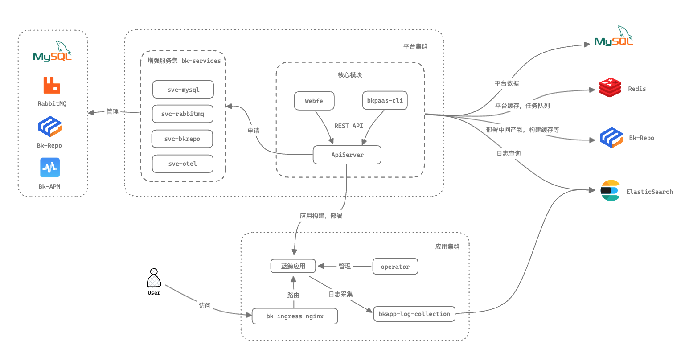

---

  

[简体中文](README.md) | English

> **BlueKing main version V7, active open source projects**

The BlueKing PaaS is an application development platform that allows developers to create and deploy SaaS applications
easily and efficiently. It includes the following core services: Developer Center, API Gateway, Unified Login, BlueKing
Console, Low Code Development Service, etc. The platform's goal is to help developers build operation-free tools and
systems quickly and cost-effectively.

This project is "PaaS Platform - Developer Center".

> **PaaS core services open source project**

- PaaS Platform - [Developer Center](https://github.com/TencentBlueKing/blueking-paas)
- PaaS Platform - [Unified Login](https://github.com/TencentBlueKing/bk-user)
- PaaS Platform - [Console](https://github.com/TencentBlueKing/blueking-console)
- PaaS Platform Low Code Development Services - [LessCode](https://github.com/TencentBlueKing/bk-lesscode)

## Architecture

## Features

The BlueKing Developer Center has launched a new version, which includes the following features:

- Newly designed user interface, giving you a more friendly experience
- The development model of the front-end and back-end separation makes the R&D collaboration of SaaS more efficient
- Support custom background process and start command, more flexible developer perspective
- Provides enhanced services such as MySQL, RabbitMQ, object storage (bk-repo)
- Through container image deployment, it becomes easier to develop BlueKing SaaS
- Fully upgrade the Python development framework to keep up with the latest Django official technical solutions
- Added Node.js development framework, immediately enjoy the low-code R&D mode of BlueKing visualization platform

## Code Directory Description

- `apiserver`: Provides REST API and is the main backend service of the BlueKing PaaS3.0 Developer Center.
- `bkpaas-cli`: PaaS3.0 command line tool that provides basic capabilities such as application information viewing and
  deployment.
- `operator`: Cloud-native application operator responsible for managing the application status, dependency resources,
  etc.
- `svc-bkrepo`: Addons service that provides application artifact storage capabilities.
- `svc-mysql`: Addons service that provides MySQL instances for storing application data.
- `svc-otel`: Addons service that improves application observability (BlueKing monitoring capabilities).
- `svc-rabbitmq`: Addons service that provides RabbitMQ instances for application task queues.
- `webfe`: PaaS3.0 frontend module, a single-page application built on Vue.js.

## Getting started

- [Local Developing(In Chinese)](docs/DEVELOP_GUIDE.md)

## Support

- [FAQ(In Chinese)](https://bk.tencent.com/docs/markdown/PaaS平台/产品白皮书/常见问题/FAQ.md)
- [white paper(In Chinese)](https://bk.tencent.com/docs/markdown/PaaS平台/产品白皮书/产品简介/README.md)
- [bk forum](https://bk.tencent.com/s-mart/community)
- [bk DevOps online video tutorial(In Chinese)](https://bk.tencent.com/s-mart/video)
- Join technical exchange QQ group:

## BlueKing Community

- [BK-CI](https://github.com/TencentBlueKing/bk-ci): a continuous integration and continuous delivery system that can
  easily present your R & D process to you.
- [BK-BCS](https://github.com/TencentBlueKing/bk-bcs): a basic container service platform which provides orchestration
  and management for micro-service business.
- [BK-SOPS](https://github.com/TencentBlueKing/bk-sops): an lightweight scheduling SaaS for task flow scheduling and
  execution through a visual graphical interface.
- [BK-CMDB](https://github.com/TencentBlueKing/bk-cmdb): an enterprise-level configuration management platform for
  assets and applications.
- [BK-JOB](https://github.com/TencentBlueKing/bk-job): BlueKing JOB is a set of operation and maintenance script
  management platform with the ability to handle a large number of tasks concurrently.

## Contributing

If you have good ideas or suggestions, please let us know by Issues or Pull Requests and contribute to the BlueKing
Open Source Community. For bk-PaaS branch management, issues, and pr specifications, read
the [CONTRIBUTING(In Chinese)](docs/CONTRIBUTING.md)

If you are interested in contributing, check out the [CONTRIBUTING.md], also join
our [Tencent OpenSource Plan](https://opensource.tencent.com/contribution).

## License

bk-PaaS is based on the MIT protocol. Please refer to [LICENSE](LICENSE.txt)
